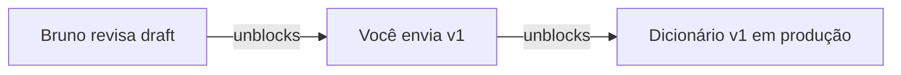

# O Segundo Cérebro — Manual do Dia a Dia

> **Como ler este manual:** está escrito como se eu estivesse te apresentando a
> ferramenta numa mesa, com a tela aberta — exemplos de verdade, comandos de
> verdade, saídas de verdade. Nenhum termo técnico sem explicação. Se você ler
> até o fim, você entende o framework inteiro: as pastas, o fluxo, as regras e
> os limites.
>
> Exemplos usam nomes fictícios (Ana, Bruno, projeto "Migração") — o framework
> em si não conhece ninguém: qualquer pessoa clona, popula e faz dele o cérebro dela.

---

## 1. A ideia em 60 segundos

Seu conhecimento de trabalho vive espalhado: transcrições de reunião num lugar,
PDFs de política em outro, tickets no Jira, PRs no GitHub, emails na caixa,
threads no Slack, docs vivos no Drive. Cada peça individual faz sentido; o
conjunto é irrecuperável. Você *teve* a informação e não consegue *achar* a
informação.

O Segundo Cérebro resolve isso com um acordo simples:

- **Você** joga tudo — tudo mesmo, sem organizar — numa única porta de entrada.
- **O agente** lê, extrai o que importa, indexa por pessoa/projeto/assunto e
  mantém prontas as visões que você usa no dia a dia.
- **Nada se perde e nada se corrompe**: o original nunca é editado, os registros
  nunca são reescritos, e a parte "fresca" pode sempre ser reconstruída do zero.

Ele **não trabalha por você**. Ele não cria card, não move card, não responde
e-mail, não comenta PR. Ele observa, organiza, conecta e responde — para você.

---

## 2. O que ele é — e o que ele NÃO é

| Ele É | Ele NÃO É |
|---|---|
| Um arquivo morto completo e pesquisável da sua vida profissional | Um robô que executa tarefas |
| Um assistente que resume e extrai de tudo que você jogar | Um app SaaS com login e mensalidade |
| Um painel sempre pronto: dia, semana, projetos, pessoas, goals | Um banco de dados que exige schema antes de usar |
| Um observador silencioso de Jira, GitHub, Gmail, Slack e Drive (só leitura) | Um integrador que escreve nas suas ferramentas |
| Pastas e Markdown locais — seu dado é seu, em texto plano | Um produto que fecha ou muda de preço e leva seu histórico |
| Portátil entre agentes (Cursor, Codex, Claude Code) | Amarrado a um fornecedor de IA |

---

## 3. O tour das pastas — as cinco zonas

A estrutura inteira tem 5 zonas. Cada uma tem **uma regra de escrita** — e é a
regra, não a pasta, que protege os dados.

```
brain/
├── vault/PROFILE/     quem eu sou (curado, muda raramente)
├── vault/PLANNING/    goals → projetos → entregáveis (curado, com trava)
├── vault/RAW/
│   ├── inbox/   a ÚNICA porta de entrada — você e conectores só escrevem aqui
│   └── 2026/
│       ├── 09/  arquivo morto — o AGENTE arquiva aqui no /dump
│       └── 10/
├── vault/PROCESSED/   caderno de registros — espelha os meses, só se adiciona
└── vault/FRESH/       quadro branco — sempre reescrito, sempre reconstruível
```

### 3.1 `vault/PROFILE/` — quem eu sou

Você em texto: papel atual, frentes de trabalho, como gosta de operar, o que
importa. O agente usa como contexto para *tudo* (um resumo de reunião para um
analista júnior é diferente do que para você). **Quem escreve:** você, ou o
agente mediante proposta que você aprova. Muda raramente — é identidade, não
diário.

### 3.2 `vault/PLANNING/` — onde eu quero chegar

A hierarquia: **goal → projeto → entregável → ação**. Mora em dois arquivos:

- **`goals.md`** — a árvore viva, com IDs (`G#` goal, `P#` projeto):

```markdown
## Goals ativos

### G2 — Destravar a frente de dados
- **Por quê:** sem dicionário comum, toda análise nasce discutida
- **Horizonte:** 30/11 · **Status:** ativo · **Progresso:** 60% (declarado por você)

#### P1 · Padronização de métricas
- Entregável: dicionário de dados v1 — draft qua 16/09 — em revisão
- Entregável: pipeline no padrão X — 30/10 — não iniciado
```

- **`log.md`** — o livro de bordo das mudanças: toda criação/fechamento/
  recongelamento de goal entra com data, diff, motivo, evidência e sua
  aprovação ("ok", "1a"). É daqui que o `/timeline` conta as viradas de rumo.

**É a única zona com trava de verdade:** o agente pode *propor* criar, fechar
ou mudar goal/projeto (diff com evidência), mas só entra com sua aprovação
explícita. Estado factual (progresso declarado, datas observadas, links) o
agente atualiza sozinho — com log. As ações (`A-####`) **não moram aqui**:
moram no ledger do PROCESSED (seção 6); o PLANNING é a bússola, não a fila.

### 3.3 `vault/RAW/` — o arquivo morto (inbox única, partição por ano/mês)

A porta de entrada é **UMA**: `vault/RAW/inbox/`. Transcrições, PDFs, decks, notas,
dumps de conectores — tudo cai aí, como veio, sem renomear, sem escolher pasta,
sem navegar ano/mês. **Você nunca organiza nada.**

**Quem arquiva é o agente, no `/dump`:** cada item da inbox é movido para
`vault/RAW/<ano>/<mês>/` pela data de captura — mover, nunca editar (colisão de nome
ganha sufixo `-2`). Dentro do mês, tudo plano, sem subpastas por tipo: o tipo é
detectado no processamento, e os conectores prefixam a fonte no nome do arquivo
(`slack-…`, `gmail-…`, `gdoc-…`, `jira-…`).

**Regra: conteúdo imutável.** Nada que entra é editado ou apagado — o agente só
move da inbox pro mês. A data de captura define a partição; a data do *evento*
(a reunião foi dia 12, o doc é de agosto) mora nos metadados do artefato. E é
seu processo seletivo inconsciente preservado: se o agente pudesse "limpar" o
bruto, ele decidiria o que você esquece.

### 3.4 `vault/PROCESSED/` — o caderno de registros (por mês)

O que o agente extrai de cada item do RAW, espelhando a partição
(`vault/PROCESSED/2026/09/`...). Três moradores:

- **Artefatos** — um por item processado: o resumo profundo, estruturado por
  tipo de documento (seção 6). Ações complexas têm ficha própria em
  `_actions/A-####.md` (contexto, passos, decisões ligadas).
- **Índices** — o atalho por entidade: `people-index.md`, `projects-index.md`,
  `subjects-index.md`. Cada linha aponta para os artefatos onde a entidade
  aparece. *Escreve-se por mês, lê-se por entidade*: você nunca pergunta "o que
  aconteceu em março" — pergunta "o que sei sobre a Ana?", e o índice entrega.
- **Logs** — os livros-razão da sua vida profissional, em `_logs/`:
  `actions.md` (o dossiê de cada ação: aberta → atualizada → fechada, com
  `blocked-by`/`unblocks`/`proj`/`waiting` — o grafo de dependências mora aqui)
  e `deliveries.md` (o que foi ENTREGUE, com resultado e evidência — a matéria
  -prima dos recaps). Append-only como tudo aqui: o histórico é o produto.

**Regra: append-only** (só se acrescenta, nunca se reescreve ou apaga). Registro
errado se corrige com um registro novo que aponta o erro — como um livro-caixa.
Histórico é o produto.

### 3.5 `vault/FRESH/` — o quadro branco

As visões que você consome: `daily-brief.md`, `week.md`, `month.md`, `projects.md`,
`stakeholders.md`, `open-actions.md`, `live-items.md`, `pocket.md` (a versão
pro gestor) — e duas visuais, que renderizam de graça em Obsidian/GitHub,
**geradas sob demanda** (`/map` e `/timeline` — não gastam o noturno):
`map.md` (grafos Mermaid: áreas→goals→projetos, stakeholders×projetos,
dependências entre ações) e `timeline.md` (linha do tempo do que aconteceu +
gantt dos deadlines à frente). **Regra: 100% derivado e descartável** —
nada aqui é informação única; tudo se reconstrói de PROFILE + PLANNING +
PROCESSED. Se amanhã uma view melhor aparecer, apaga-se e gera outra, sem perda.
O invariante que guarda a zona: *se não é derivável, está na pasta errada.*

---

## 4. Um dia com o cérebro (segunda-feira, simulado de verdade)

### 08h50 — você chega e pergunta: `/brief`

```
☀ BRIEF — segunda, 14/09 · gerado 08:52 (nightly de ontem + 0 mudanças)

HOJE
  10:00  1:1 com Ana (gestora)     → card de prep pronto em vault/FRESH/stakeholders.md
  15:00  Cerimônia do time Migração

ATRASADAS (2)
  A-0141  Enviar dicionário de dados p/ revisão do Bruno   (2 dias)

PRÓXIMAS 72H
  · Qua 16/09 — deadline: draft do dicionário v1 (projeto Padronização)
  · Qui 17/09 1:1 com Bruno

GOAL EM FOCO
  G2 Destravar frente de dados → 3/5 entregáveis · próxima pedra: draft qua

CONTEXTO DA ÚLTIMA SEMANA (5 linhas)
  · Decisão D-0089: pipeline de métricas migra p/ padrão X (reunião 09/09)
  · PR #142 (repo metrics) teve review — 3 comentários não respondidos
  · Card MIG-101 (seu, no Jira) moveu p/ "In review" sexta
  · Gmail ontem: 23 emails · 2 de stakeholders (Ana: "dá pra adiantar o draft?")
  · #gtm (Slack): thread nova sobre plano de retenção Q4 (14 msgs)
```

Note as três últimas linhas: o cérebro **viu** seu GitHub, seu Jira, sua caixa
de entrada e seus canais — porque toda noite os conectores de leitura puxaram
as mudanças (seção 7). Ele não comentou no PR, não moveu o card, não respondeu
a Ana. Só sabe.

### 10h00 → 11h00 — reunião, transcrição, `/dump`

No 1:1 com a Ana, você gravou (ou anotou). Ao terminar, salva o arquivo em
`vault/RAW/inbox/` — sem renomear, sem escolher pasta — e roda `/dump`. O agente
arquiva em `vault/RAW/2026/09/` e responde no chat — **o relatório curto, para você**:

```
✓ 1 item processado (0 duplicado):
  · raw-…-1a1-ana.md → reunião: 2 decisões (D-0092, D-0093), 1 ação p/ você
    (A-0146), 1 thread aberta (orçamento Q4), menções: Ana, Bruno, G2
```

Mas o que fica guardado em `vault/PROCESSED/2026/09/` é o **artefato completo**:

```markdown
# REUNIÃO · 1:1 Ana · 2026-09-14
fonte: vault/RAW/2026/09/raw-2026-09-14-1a1-ana.md · processado: 2026-09-14

## Contexto
1:1 quinzenal com Ana (gestora, frente de dados). Tom: alinhamento de Q4.

## Decisões
- D-0092 [observado] Dicionário de dados v1 sai como draft quarta (16/09),
  sem esperar o pipeline novo. Base: reunião, fala da Ana min 04-07.
- D-0093 [observado] Bruno entra como revisor técnico do dicionário.

## Ações
- A-0146 · VOCÊ · enviar draft p/ Bruno até qua 16/09 · nasce de D-0092

## Threads abertas
- Orçamento Q4 da frente: Ana vai levantar número com financeiro até 28/09.
  (acompanhar — não é ação sua, é dependência)

## Citações-chave
- "prefiro meio dicionário em produção do que dicionário perfeito em dezembro" (min 06)

## Menções → índices
Ana (atalho p/ este artefato · última interação: hoje) · Bruno (revisor) · G2
```

E os índices ganharam uma linha cada. **Seis meses depois**, quando você rodar
`/ask "quando a Ana falou do orçamento de Q4?"`, o agente acha por índice,
abre este artefato, cita a thread, e — se você quiser a fala exata — volta na
transcrição bruta no RAW. Fidelidade total, sempre.

### 14h00 — chega um monstro: PDF de política, 40 páginas

Alguém te mandou a política nova de dados. Você salva o PDF em `vault/RAW/inbox/`
e roda `/dump` de novo.

Aqui entra o desenho por **tipo de documento** — um PDF de política não é uma
reunião, e extrair "ações e decisões" dele seria inútil. O artefato de
**documento longo** é outra coisa:

```markdown
# DOCUMENTO · Política de Tratamento de Dados v3 · 40 págs
fonte: vault/RAW/2026/09/politica-dados-v3.pdf · processado: 2026-09-14

## Do que trata
Política corporativa de coleta/retenção/exclusão de dados de clientes.

## TL;DR executivo (5 linhas)
Retenção de dados de lead sobe de 12 → 24 meses; exclusão por solicitação
(LGPD) tem SLA de 15 dias; dados anonimizados ficam liberados p/ analytics.

## Mapa de seções (o índice do documento)
  p.4   Princípios gerais
  p.9   ★ Retenção por tipo de dado        ← afeta seu projeto Padronização
  p.17  Exclusão e direitos do titular
  p.26  Dados anonimizados e analytics
  p.33  Governança e papéis

## Pontos que afetam VOCÊ
- p.9: janela de retenção 24m muda o cálculo do dicionário de dados
  (campo `retencao_meses` precisa refletir a nova regra) → ligado ao G2

## Perguntas que este documento responde
"qual o SLA de exclusão?" → p.17 · "o que posso usar em analytics?" → p.26
```

O artefato é **o mapa; o RAW é o território**. Quarta-feira, no meio do
dicionário, você pergunta `/ask "o que exatamente a política define como dado
anonimizado?"` — o mapa diz p.26, e o agente lê a página 26 *do PDF original no
RAW* e responde citando. O mapa não precisava conter a resposta; precisava
saber **onde ela mora**. É assim que um PDF de 40 páginas vira contexto sem
virar resumo raso.

### 16h30 — uma pergunta solta: `/ask`

```
você: /ask o que já decidimos sobre o padrão de nomenclatura das métricas?

agente: Duas decisões constam:
  · D-0089 (reunião 09/09, cerimônia do time): pipeline migra p/ padrão X —
    defendido pelo Bruno, aprovado pela Ana. [observado]
  · D-0071 (doc "Proposal-metricas.pdf", 02/09): sufixo de unidade obrigatório.
    [doc]
Não consta: decisão sobre prefixo de escopo. Quer que eu abra alguma fonte?
```

Três coisas para notar: respondeu **citando a fonte** (artefato de qual reunião/
documento); marcou a **proveniência** (`[observado]` = dito em reunião,
`[doc]` = escrito em documento, `[sem fonte]` = o agente não achou base — e
isso aparece); e foi honesto sobre o que **não sabe**. "Não consta" é uma
resposta válida e frequente — um cérebro que inventa memória é pior que nenhum.

### 18h00 — você fecha o note. Aqui fora, o noturno

À noite (cron às ~05h, ou quando o `/brief` da manhã detectar que não rodou),
o cérebro roda `/update` sozinho. Os conectores puxam **todas as fontes** —
Jira, GitHub, Gmail (digest do dia), Slack (canais fixos), Drive (watchlist) —
e despejam snapshots em `vault/RAW/inbox/`. O `/dump` arquiva e processa: fonte que
mudou vira **change digest**; fonte idêntica é arquivada em silêncio. As views
de FRESH são regeradas — e amanhã 08h50 o `/brief` já nasce atualizado. Se seu
notebook estava desligado às 5h, o `/brief` detecta o atraso e se atualiza
antes de responder. Nada apodrece em silêncio.

---

## 5. Uma semana com o cérebro

### Na terça, de repente: `/connect`

Você quer o estado *agora* — vai entrar numa reunião e quer saber se seu PR
andou. Roda `/connect`:

```
✓ conectores rodaram (leitura, ~90s):
  github/metrics-repo → 2 novidades: PR #142 +2 comentários (sem resposta
                        sua); issue #318 (atribuída a você) foi fechada
  jira/board-migracao → MIG-101 continua "In review"; MIG-118 (novo,
                        atribuído a você) criado ter pela Ana
  gmail               → 23 emails ontem (digest completo) · 2 de stakeholders
  slack/#retention    → 1 thread nova: plano de retenção Q4 (14 msgs)
  gdocs/dicionário    → §3 "Campos" reescrito pelo Bruno + 2 comentários novos
→ snapshots em vault/RAW/inbox/ (prefixo da fonte no nome) · rode /dump p/ processar
```

Duas semanas depois, quando você perguntar "quando o MIG-118 apareceu na minha
vida?", a resposta está no PROCESSED — com data, e sabendo que a Ana o criou.

### Sexta, 17h — o cockpit: `/week`

```
⛏ SEMANA 38 · lookahead 14 dias

DEADLINES        qua 16/09 draft dicionário v1 (G2, sua ação A-0146) · seg 21/09
                 entrega intermediária Migração
REUNIÕES         3 na semana (cards de prep: Ana, Bruno, cerimônia)
GOALS            G1 onboarding — 80% · G2 frente dados — 3/5 · G3 apoio BI —
                 travado (nenhuma ação movida há 12 dias ⚠)
AÇÕES ENVELHECENDO  A-0130 (9 dias, dependência externa — escalar?)
FOCO SUGERIDO    fechar draft do dicionário; destravar G3 com 30min na segunda
```

E é no `/week` que mora o **gate de goals**. O agente percebe que G3 não anda
há 12 dias e *propõe*:

```
PROPOSTA DE MUDANÇA (nada foi alterado ainda):
  G3 "Apoio ao BI" · status: ativo → congelado até 05/10
  por quê: sem movimento 12 dias; deadline real do G2 é 16/09
  evidência: A-0130 última atualização 02/09; nenhuma menção em reuniões desde
aprovar? (ok / editar / descartar)
```

Você responde "ok" e a mudança entra, com data, motivo e sua assinatura no log.
Responde "descartar" e o agente nunca mais re-propõe o mesmo sem evidência
nova. **Essa é a única trava do sistema** — goals e projetos são os únicos
arquivos onde criar/mudar/fechar exige você. Todo o resto o agente escreve
livremente *na zona dele*.

### O planejamento em escada: dia → semana → mês (+ a pocket)

Três horizontes, um por view — cada nível enxerga mais longe e agrega mais:

| View | Janela | O que decide |
|---|---|---|
| `daily-brief.md` | hoje + 72h | o que eu executo AGORA (e o que está atrasado me bloqueando) |
| `week.md` | 14 dias | o foco da semana, o radar de goals, as propostas de mudança (o gate) |
| `month.md` | 30-45 dias | por goal → projeto → entregável: deadlines, progresso, dependências que atravessam projetos |

`month.md` é a visão de rota: enxerga cadeias que o dia esconde — "o draft de
16/09 destrava o pipeline de 30/10; se o draft escorregar, o mês inteiro do G2
escorrega junto". E pra quem só tem 1 minuto: **`pocket.md`** — a página pro
coordenador/gerente: status por goal em uma linha, foco da semana, entregue
recentemente, e os bloqueios que dependem *deles* (com nome de quem). Derivada
das mesmas fontes; compartilhável por copy-paste.

Todas derivam de `PLANNING/goals.md` + `deliveries.md` + índices — nunca são
editadas à mão; o `/update` as regenera toda noite.

### O cérebro desenhado: `/map` e `/timeline`

Sob demanda (não gastam o noturno), dois documentos visuais em **Mermaid** —
abrem renderizados no Obsidian e no GitHub:

- **`/map`** → `map.md`, três grafos: **áreas → goals → projetos** (a floresta
  inteira num olhar), **stakeholders × projetos** (quem está em quê, com o
  papel), e o grafo de **dependências entre ações abertas** — setas verdes
  (`unblocks`) e vermelhas (`blocked-by`, com ⛔ no nó bloqueado):



- **`/timeline`** → `timeline.md`: o **passado** como linha do tempo (entregas
  do `deliveries.md`, decisões que mudaram direção, viradas de goal do
  `log.md`) e o **futuro** como **gantt** de 30-45 dias com os entregáveis por
  projeto e o hoje marcado. Timeline honesta: período sem evento não entra.

Ambos com header `generated-at:` — a idade do desenho é sempre visível.

### O mês vira

Outubro nasce: `vault/RAW/2026/10/` e `vault/PROCESSED/2026/10/` se criam sozinhos no
primeiro `/dump` de outubro. Setembro fica como está — arquivo morto e caderno
fechados, sempre consultáveis pelos índices, que seguem crescendo (os índices
são globais; a partição por mês é só o endereço).

### Memória de entrega: `deliveries.md` e o `/recap`

O caderno também guarda **o que você ENTREGOU** — não só o que deve.
`_logs/deliveries.md` é o livro-razão das entregas: toda vez que você declara
"fechei X" no `/week` (ou uma ação fecha com resultado), uma linha nasce —
`data · o que · resultado · evidência · [proveniência]`. Sem número inventado:
resultado não declarado fica registrado como "não declarado".

É daí que nasce o **`/recap [goal|projeto|período]`**: um dossiê datado e
**compartilhável** (gerente lê sem conhecer o cérebro) em `vault/reports/` —
objetivo, entregas com resultado, impacto, pendências, fontes pra auditoria.
Reports são point-in-time: nunca reescritos, regerar cria arquivo novo.
E pra o dia a dia com a liderança: `FRESH/pocket.md` — 1 página com status
por goal, foco da semana, entregue recentemente e os bloqueios que dependem
deles.

Um recap parece isto (autocontido — quem lê não tem acesso ao cérebro):

```markdown
# G2 · Destravar a frente de dados — recap & impacto
_Gerado em 30/11 · cobre 15/09–30/11 · fontes no fim_

## Objetivo
Unificar a definição de métricas de retenção para acabar com a disputa
de números nos comitês.

## O que foi entregue
- Dicionário de dados v1 em produção (02/10) — 100% das métricas do pipeline
  documentadas. Resultado: consultas de métricas sem abertura de ticket
  (declaração da Ana, 1:1 de 15/10).
- Pipeline de ingestão no padrão X (28/11) — queda de 40 min para 6 min no
  refresh diário (dashboard de monitoramento [doc]).

## Resultado & impacto
Zero disputas de número nos 3 comitês desde 15/10 (antes: 2/mês, em média
de menções em atas). Qualitativo, ainda sem métrica formal de adoção.

## Pendências
- Treinamento do time de CS no dicionário (dez/26).

## Fontes
- D-0092 (reunião 14/09) · deliveries 02/10 e 28/11 · A-0146, A-0151
```

---

## 6. Por dentro do `/dump` — a esteira de processamento

É o comando central. Passo a passo do que ele faz:

1. **Varre** `vault/RAW/inbox/` procurando itens ainda não processados (cada artefato
   carrega a fonte; fonte que já tem artefato é pulada — é isso que o torna
   **idempotente**: rodar duas vezes não duplica nada).
2. **Arquiva** cada item novo em `vault/RAW/<ano>/<mês>/` pela data de captura —
   mover sem editar; colisão de nome ganha sufixo `-2`.
3. **Classifica o tipo**: reunião, documento longo, nota solta, dump de conector.
4. **Extrai pelo template do tipo** (tabela abaixo).
5. **Resolve identidades**: "Bia", "Beatriz C.", "beatriz.costa@…" são a mesma
   pessoa — cada pessoa tem aliases; o agente nunca cria segunda ficha de quem
   já tem ficha.
6. **Escreve o artefato** em `vault/PROCESSED/<ano>/<mês>/` e **apensa aos índices**.
7. **Relata** no chat — as tais ~5 linhas por item, para você auditar se valeu
   a pena. O relatório é o recibo; o artefato é o produto.

| Tipo | Como reconhece | O que o artefato extrai |
|---|---|---|
| **Reunião** | transcrição, ata, gravação | contexto · decisões (D-####) · ações por pessoa (A-####) · threads abertas · citações-chave com minuto |
| **Documento longo** | PDF, política, apresentação, doc extenso | do-que-trata · TL;DR executivo · **mapa de seções com página/âncora** · pontos que afetam seus goals · perguntas que o doc responde |
| **Nota solta** | anotação curta, ideia, lembrete | nota limpa · tags · ligações com entidades existentes |
| **Dump de conector** | saída de script (jira/github/gmail/slack/gdocs) | **change digest**: só o que mudou desde o último pull daquela fonte |

Toda extração leva tag de proveniência — `[doc]`, `[observado]`, `[declarado]`
(afirmação direta sua, o nível mais alto), `[sem fonte]` —
porque "a política diz", "alguém comentou numa reunião" e "eu estou afirmando"
não pesam igual numa decisão.

**Ações carregam o grafo:** quando a fala revela dependência ("assim que o
Bruno revisar, eu envio"), as ações ganham os campos `blocked-by:` / `unblocks:`
(+ `proj:`, `link:`, estado `waiting` pra quem espera terceiro). O `/brief` e o
`/week` mostram as cadeias (`⛔ blocked-by: A-0147 — Bruno`), e o `/map` desenha
o grafo inteiro. Bloqueio visível é cobrança fácil — e atraso sem culpa.

**A ação que NASCE de você: `/todo`.** Nem toda ação vem de reunião — a maioria
vem da sua cabeça, no meio do dia. `/todo preciso ler esse material até quarta`
→ o agente parseia (o quê · deadline "quarta" resolvida em data real · pessoas
por alias · `proj:` se você citar) e apensa direto no ledger:

```
A-0152 · aberta · 2026-09-16 · ler material de retenção · dono: VOCÊ ·
  deadline 2026-09-18 · proj: P1 · origem: /todo (declarado pelo dono)
```

E se o texto NÃO traz prazo/projeto/pessoa, o agente pergunta o que falta —
**em uma rodada só, com sugestões** (você responde "1a 2pula 3Ana"):

```
A-0153 · ler material de retenção — antes de eu registrar:
1. Para quando?  (a) qua 18/09  (b) sex 20/09  (c) sem prazo  (d) outra
2. Projeto?      (a) P1 Padronização  (b) P3 Onboarding  (c) nenhuma  (d) outra
3. Alguém além de você?  (a) nenhum  (b) outra
```

Cada resposta encaixa a ação no planejamento: prazo a coloca no `/brief` e no
gantt do `/timeline`; projeto a liga à árvore de goals (radar do `/week`,
`month.md`, recaps); pessoa a liga às threads e ao prep de reunião. Texto já
traz tudo → zero perguntas, cria direto — TODO rápido continua rápido.

**E fechar é `/done`** — o par exato. Concluiu? Conta pro cérebro na hora:

```
você: /done A-0146 enviado — o Bruno confirmou recebimento
agente: A-0146 fechada (enviado, confirmado) · delivery registrada ·
        A-0151 desbloqueada
```

Três coisas acontecem juntas: a linha de fechamento no ledger (`fechada ·
como`), a **cascata** (ações que ela travava ganham "desbloqueada"), e — só
se for entrega de verdade (tinha projeto, ou o resultado é observável) — a
linha em `deliveries.md` com a tag **`[declarado]`** (afirmação sua, o nível
mais alto de proveniência). Ação operacional ("li o material") só fecha:
checkbox não é entrega, e o recap agradece o silêncio. Na sexta, o `/week`
aceita o lote ("fechei X, Y e Z") com este mesmo protocolo — um /done por
coisa, sem cerimônia.

Confirmação em 2 linhas, e a ação já aparece no `/brief` e no `open-actions`
sem mais nada. **Sem arquivo manual na inbox — e sem risco de perda:** o
registro É arquivo (linha append no `_logs/actions.md`, zona eterna do
PROCESSED); o `/update` nunca reconstrói o PROCESSED, só lê — o que ele
regenera são as views, que derivam justamente do ledger. Pessoas e projetos
linkados ganham sua linha de menção nos índices na hora (o `/person` e o
`/project` veem a ação). Por que não arquivo na inbox? Porque o dump teria
que re-parsear via LLM o que você já disse certo — custo, latência e risco
de errar o que estava certo. Declaração estruturada → ledger direto.

E o RAW? **Nunca é tocado** — só movido da inbox pro mês. O arquivo bruto é a
prova original; tudo à frente é derivado e reprocessável.

---

## 7. Os conectores — só observam, nunca mexem

O princípio que governa esta parte: **é um segundo cérebro, não um segundo
você.** Ver o seu board é memória; mover o seu card é trabalho — e trabalho é
só seu. A política, em uma linha: **o agente lê o mundo exterior; o mundo
exterior nunca é escrito por ele.** Nenhum token tem escopo de escrita.

### 7.1 Fontes vivas: snapshots datados, mudanças processadas

Google Docs, Slack, Gmail, boards — não são arquivos estáticos, são fluxos que
mudam, ganham comentários, são reescritos. O cérebro não finge que são
estáticos; ele guarda uma **linha do tempo de snapshots** e processa
**diferenças**:

1. Cada pull **exporta** a fonte (doc, canal, caixa de entrada, board) → um
   snapshot em Markdown cai em `vault/RAW/inbox/`, prefixado pela fonte
   (`gdoc-…`, `slack-…`, `gmail-…`).
2. O **hash** do snapshot é comparado ao anterior da mesma fonte: idêntico →
   arquiva e segue (zero ruído, zero custo de IA); diferente → o artefato é um
   **change digest** — "o que mudou desde o último pull".
3. Comentários (Google Docs, PRs) fazem parte do snapshot — comentário novo é
   mudança.
4. Os índices costuram a linha do tempo: `/ask "o que mudou no dicionário?"`
   agrega os digests em ordem, cada um citando seu snapshot.
5. Fontes vigiadas têm um **registro próprio** — `_indices/live-items-index.md`,
   append-only: uma seção por item (doc, board, canal), primeira linha = estado
   inicial, uma linha por mudança (`data · snapshot · o que mudou`). É o
   "repositório de itens vivos": a view `vault/FRESH/live-items.md` deriva dele
   (última mudança, idade, estabilidade de cada item). Pull sem mudança =
   silêncio; fluxos sem identidade por item (digest diário do Gmail) ficam de
   fora — o artefato diário já é o registro.

O doc vivo continua vivo lá fora; aqui dentro, cada estado dele ficou congelado
e citável.

### 7.2 As fontes e seus comportamentos

| Fonte | Quando puxa | O que vira |
|---|---|---|
| **Jira** | noturno | digest de **três escopos, todos escolhidos em watch.yaml**: seus cards · cards que você segue (watcher) · boards do time inteiros — nada de criar, mover ou comentar |
| **GitHub** | noturno | digest dos repos que VOCÊ listar: PRs, issues, reviews nos seus códigos |
| **Gmail** | noturno: digest do dia · sob demanda: `/gmail [janela\|filtro]` | **OAuth read-only (script)** — snapshot + digest; corpo lido quando você pedir |
| **Slack** | noturno: canais E pessoas que você listar em watch.yaml · sob demanda: `/slack #canal` ou `/slack @user [período]` — janela padrão **7 dias**, overridável (`/slack #canal 30d`) | transcrição do período; observados viram digest |
| **Drive** | noturno: watchlist de docs que VOCÊ listar · busca ad-hoc `/drive <termo>` | **OAuth read-only (script)** — snapshot do doc + comentários; change digest se mudou |

### 7.3 A configuração (mora na instância, nunca no framework)

Além de listar fontes, o `config/watch.yaml` tem **kill-switch**: qualquer item
(github repo, doc do Drive, board) ou seção inteira (gmail, slack) aceita
`enabled: false` — a fonte fica **muda**: o conector pula o pull e declara em
1 linha; não é erro, ninguém debuga. Reativar = apagar a linha. Exemplo
comentado no `config/watch.yaml.example`.

`config/watch.yaml` — o que observar é escolha sua, em texto:

```yaml
github:
  - rdstation/metrics-repo        # repos que VOCÊ listar — quantos quiser
  - rdstation/gtm-handbook
jira:
  me: true                        # seus cards (assignee = você)
  following: true                 # cards que você segue (watcher)
  boards: [MIG, RET]              # boards do time, INTEIROS — quantos quiser
gmail:
  window: daily                   # digest completo do dia anterior
slack:
  channels: ["#retention", "#squad-cs", "#gtm"]  # canais — quantos quiser
  users: ["@ana", "@bruno"]                      # pessoas/DMs — quantos quiser
  default_window: 7d              # janela padrão do /slack
gdocs:
  - id: 1AbC…   # Dicionário de Dados (dono: Bruno)
  - id: 1XyZ…   # OKRs Q4 — frente de dados
schedule: nightly                # junto com o /update
```

`.env` — credenciais, **só na instância**, permissão 600, tokens **read-only**.
O framework entrega `.env.example` com nomes de variáveis, nunca valores: um
`git clone` do framework nunca carrega segredo de ninguém.

**Ordem de build:** Jira + GitHub + Slack primeiro (tokens diretos) → Gmail →
Drive (o OAuth do Google é o mais chato — por isso fica pro fim).

Tecnicamente, os conectores são **scripts determinísticos de leitura** (sem IA,
sem custo, sem surpresa): chamam a API com o token, escrevem o snapshot em
Markdown na inbox, e acabou. Dali em diante é o mesmo cano de sempre: o `/dump`
trata o snapshot como trata qualquer arquivo que você jogou lá.

---

## 8. As regras de ouro — matriz de permissões

| Zona | Regra | Agente pode | Agente NÃO pode |
|---|---|---|---|
| `vault/RAW/` | conteúdo imutável | ler (e reler, sempre) · mover da inbox pro mês | editar, apagar, "organizar" conteúdo |
| `vault/PROCESSED/` | append-only | acrescentar artefatos e linhas de índice | reescrever ou apagar o que escreveu |
| `vault/FRESH/` | descartável | regenerar views inteiras | guardar informação única (não-derivável) |
| `vault/PROFILE/` | curado | propor edições | aplicar sem aprovação |
| `vault/PLANNING/` | curado + gate | atualizar estado factual com log | **criar/mudar/fechar goal ou projeto sem sua aprovação** |
| Ferramentas | read-only | puxar via conectores | criar, mover, comentar, responder — nunca |

Três travas transversais:

1. **Segredos nunca aparecem** — nem no chat, nem em log, nem em artefato. `.env`
   na instância, permissão restrita, ponto.
2. **Toda escrita é rastreável** — ações (`A-####`) e decisões (`D-####`) têm log
   append-only; mudanças de goal têm data, motivo e sua aprovação registrada.
3. **Honestidade sobre o que não sabe** — extrações citam fonte e proveniência;
   "não consta" é resposta válida; inventar memória é o único erro imperdoável
   de um cérebro.

---

## 9. Começando do zero — qualquer pessoa, ~10 minutos

O desenho separa **framework** (o produto, clonável, sem nada seu dentro) de
**instância** (o seu cérebro, com seus dados — nunca commitado em lugar nenhum):

```bash
# 1. clonar — esta pasta É a instância (mantenha o .git para atualizar depois)
git clone <repo-do-framework> ~/brain
cd ~/brain

# 2. COPIAR o esqueleto das zonas pra raiz (cp, não mv — template/ fica no
#    repo intacta; suas cópias na raiz são invisíveis pro git)
cp -r template vault

# 3. conectores (opcional — o cérebro funciona 100% manual sem eles)
cp config/.env.example config/.env && chmod 600 config/.env   # SEUS tokens read-only
cp config/watch.yaml.example config/watch.yaml                # liste o que observar

# 4. abrir a pasta no seu agente (Cursor, Codex, Claude Code) e rodar:
#    /init → entrevista + vault/PROFILE/PLANNING propostos; arquivos soltos
#    durante a entrevista viram o primeiro dump

# 5. viver: jogar coisas em vault/RAW/inbox/ → /dump → /brief no dia seguinte
#    (atualizar o framework: git pull --ff-only · se seu agente editou
#     scripts/skills, use /upgrade — ele reconcilia tudo)
```

O cérebro **nasce vazio e fica inteligente na velocidade em que você o
alimenta**. Não há setup de banco, não há migração, não há importação — o
primeiro `/dump` do kit de onboarding dele já é o teste da esteira.

E não viva com uma cópia única: **todo domingo** o noturno zipa o vault
inteiro pra uma pasta do SEU Google Drive (retenção de 8; setup de 3 min em
`guides/backup.md`). É a única exceção de escrita da constituição — estreita:
o escopo só cria/apaga os próprios backups na pasta configurada, e segredos
(`.env`) moram fora do vault, fora do zip. `/backup status` mostra o último.

### Atualizando o framework (e o que fazer quando o agente edita código)

Sua instância é um clone — `git pull --ff-only` traz skills, conectores e
guias novos sem nunca tocar seus dados (vault e config são invisíveis pro
git). Mas agentes melhoram o mundo ao redor: editam um script, criam outro.
Aí o pull reclama (clone divergido) — e a resposta **não é proibir**, é
reconciliar:

- **`/upgrade`** — o agente faz a dança completa: classifica cada mudança
  (drift de versão antiga vs. edição genuína), `stash` → `pull` → `pop`
  **juntando** melhorias ao código novo, semeia zonas faltantes do
  `template/`, roda a checagem de saúde e reporta **candidatos a graduação
  ao upstream** (você mantém o repo — melhoria boa volta pra todos).
- **`scripts/local/`** — o berçário: scripts que SEU agente criar nascem aí
  (cego pro git): nunca bloqueiam pull, provam valor na prática, e graduam
  pro repo quando fizer sentido.
- **Lembrete de reauth**: se o OAuth do Google expirar (app em Testing =
  7 dias), o noturno deixa uma **nota na sua inbox** (vira brief no dia
  seguinte) — não é erro, é o cérebro pedindo reautorização.
- Pull simples recusado sem edição conhecida: `git stash` → pull →
  `git stash pop` resolve na mão o trivial.

---

## 10. FAQ do colega cético

**"E se eu sumir duas semanas?"**
Nada quebra. O `/brief` da volta detecta o atraso, roda o catch-up, te mostra
um resumo do que acumulou. Cérebro não cobra presença.

**"E se o agente extrair errado?"**
Você corrige apontando — a correção é um *registro novo* no PROCESSED (nada é
reescrito), a fonte bruta segue intacta no RAW como prova. E como toda
extração cita fonte, o erro é auditável.

**"Docs do Google e Slack mudam o tempo todo — como cabe isso num 'arquivo morto'?"**
Cada pull é um snapshot datado — o arquivo morto guarda a *sequência* de
estados de cada fonte, e o processamento guarda as *diferenças*. Você pergunta
"o que mudou no dicionário desde quarta?" e recebe a linha do tempo dos
digests, cada um citando seu snapshot. O doc vivo segue vivo lá fora.

**"Meu dado sai da minha máquina?"**
Armazenamento: 100% local, texto plano, sem nuvem, sem login. Ressalva honesta:
o *processamento* é feito pelo LLM do agente que você usar (Cursor/Codex/
Claude) — ou seja, o provedor daquele agente vê o conteúdo durante o
processamento, como vê qualquer arquivo que você já abre nele hoje. Se sua
empresa tem política sobre isso, ela se aplica do mesmo jeito.

**"Por que pastas e Markdown, e não Notion/Obsidian/meu app favorito?"**
Porque agnóstico é o requisito: Markdown + pastas é o único formato que todo
agente lê nativamente, que o git versiona, que sobrevive a qualquer fornecedor
mudar de preço ou fechar. Obsidian (ou o que for) pode *apontar* para a
instância como fonte de leitura — o cérebro não se importa com quem o lê.

**"E quando crescer — milhares de arquivos?"**
Foi desenhado para isso: partição por mês no armazenamento, índices por
entidade na leitura, e o agente nunca varre tudo — entra pelo índice, abre o
artefato, desce ao RAW só quando precisa da letra exata.

**"Posso trocar de agente (Cursor → Codex → Claude)?"**
Sim, sem migração. A constituição do cérebro é um `AGENTS.md` (padrão aberto
que os três leem) e os comandos são skills no padrão `SKILL.md` (idem). O
cérebro pertence a você, não ao agente.

---

## O framework inteiro em uma frase

> **Tudo entra cru por uma porta só e nada é editado; tudo que importa é
> extraído com fonte e nunca apagado; o que você consome é sempre derivado e
> sempre reconstrutível; e a única coisa que muda com a sua assinatura é o seu
> futuro — goals.**
